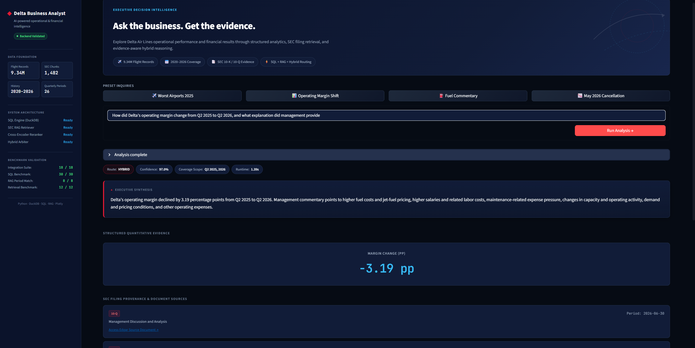
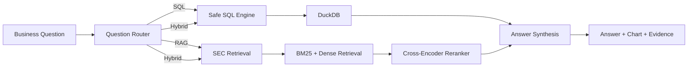
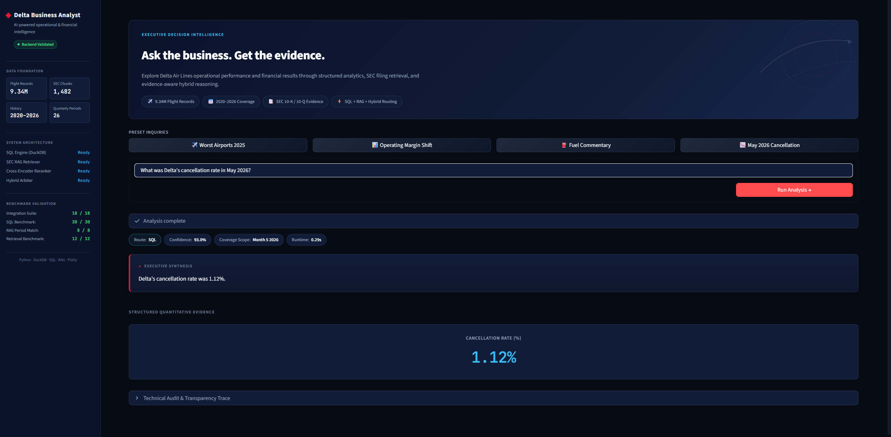
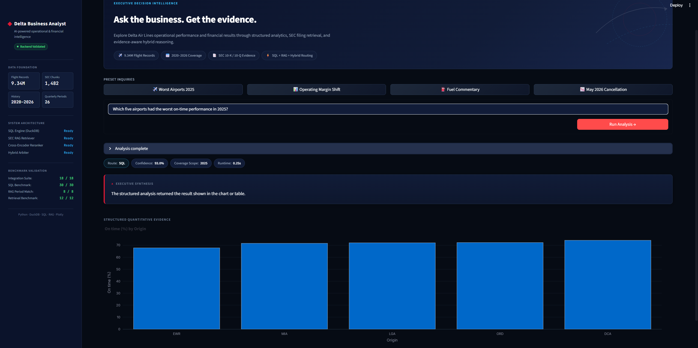

# Delta Business Analyst

### AI-powered business intelligence for Delta Air Lines operational performance, financial results, and SEC management commentary

Instead of building another static dashboard, I wanted to build something closer to how an analyst actually works:

> Ask a business question → find the right data → calculate the answer → retrieve supporting evidence → explain what happened.

The result is an interactive system that automatically routes questions through **SQL, RAG, or a combination of both**.

<p align="center">
  
</p>

---
## Live Demo

🔗 [Open the Delta Business Analyst](https://delta-business-analyst-nisha.streamlit.app/)

Explore Delta Air Lines operational and financial performance through SQL analytics, SEC filing retrieval, and hybrid business reasoning.

## ✈️ What Can It Do?

The system answers different kinds of business questions without requiring the user to know SQL or where the information is stored.

| Question Type | Example | Engine |
|---|---|---|
| Operational | What was Delta's cancellation rate in May 2026? | SQL |
| Comparative | Which airports had the worst on-time performance in 2025? | SQL |
| Financial | How did operating margin change between two quarters? | SQL |
| Management Commentary | What did management say about fuel costs? | RAG |
| Business Explanation | How did margin change, and why? | SQL + RAG |

The router determines which analytical path to use automatically.

---

## 📊 Data Foundation

| Data | Coverage |
|---|---:|
| Flight Records | **9.34M+** |
| Operational History | **Jan 2020 – Jun 2026** |
| SEC Filing Periods | **26 10-K / 10-Q periods** |
| SEC Text Chunks | **1,482** |
| Financial History | **2020 Q1 – 2026 Q2** |

Operational data comes from the **U.S. Bureau of Transportation Statistics**, while financial results and management commentary come from **Delta Air Lines SEC filings**.

---

## 🧠 How It Works



### SQL

Known analytical patterns use tested deterministic SQL. More flexible questions can fall back to natural-language-to-SQL generation, with semantic and safety validation before execution.

### RAG

SEC filings are searched using **BM25 + sentence embeddings**, followed by a **cross-encoder reranker** to surface the most relevant management commentary.

### Hybrid

For questions that ask both **what changed and why**, SQL supplies the numerical facts while SEC filings provide management context.

> **SQL owns the numbers. RAG owns the explanation.**

That separation became one of the most important design decisions in the project.

---

## 📈 Example Analysis

### Simple KPI

<p align="center">
  
</p>

### Ranking & Operational Analysis

<p align="center">
  
</p>

The interface also exposes routing confidence, detected time periods, generated SQL, SEC sources, and retrieval evidence for users who want to inspect how an answer was produced.

---

## ✅ Validation

I did not want to judge the project only by a few successful demos, so I built separate evaluation suites.

| Evaluation | Result |
|---|---:|
| SQL Analytical Benchmark | **30 / 30** |
| End-to-End Integration Benchmark | **18 / 18** |
| RAG Period-Matching Tests | **8 / 8** |
| Integration SQL Execution | **13 / 13** |

These results refer specifically to the project's defined benchmark questions rather than universal model accuracy.

---

## 🛠️ Tech Stack

**Python · SQL · DuckDB · Pandas · Streamlit · Plotly · Sentence Transformers · BM25 · Cross-Encoder Reranking · Ollama/Qwen · SEC EDGAR · BTS**

---

## 💡 What Made This Project Difficult

The hardest part was not building a dashboard. It was making several analytical systems work together reliably.

I ran into problems such as:

- SQL generation errors
- incorrect filing-period retrieval
- irrelevant or duplicated SEC evidence
- numerical values being matched to the wrong text
- deciding when a question should use SQL, RAG, or both
- keeping generated SQL safe before execution

Instead of hiding those problems, I used them to improve the architecture.

I introduced deterministic SQL for common business questions, read-only query validation, metadata-aware retrieval, reranking, integration benchmarks, and finally a strict separation between structured calculations and document-based explanation.

That process changed the project from a simple airline analysis into a small **decision-intelligence system**.


---

## 📁 Project Structure

```text
Delta_Business_Analyst/
│
├── app.py
│
├── assets/
│   └── screenshots/
│       ├── hybrid_operating_margin.png
│       ├── sql_may_2026_cancellation.png
│       └── sql_worst_airports_2025.png
│
├── evaluation/
│   ├── integration/
│   └── sql/
│
├── src/
│   ├── analytics/
│   ├── database/
│   ├── rag/
│   ├── routing/
│   ├── sql_agent/
│   └── visualization/
│
├── requirements.txt
├── .gitignore
└── README.md


## ▶️ Run Locally

### 1. Clone the repository

```bash
git clone <your-repository-url>
cd Delta_Business_Analyst
```

### 2. Create a virtual environment

```bash
python -m venv .venv
```

### 3. Activate it

Windows:

```bash
.venv\Scripts\activate
```

### 4. Install dependencies

```bash
pip install -r requirements.txt
```

### 5. Start the Streamlit app

```bash
streamlit run app.py
```

---

## 👋 About Me

I'm **Nisha Rajkumar**, an MS Business Analytics student at the **University of Rochester – Simon Business School**.

My background started in biotechnology and research, where I worked with experimental datasets and data-processing workflows. As I moved into business analytics, I became more interested in building systems that do more than produce a dashboard — systems that can help someone ask a business question, find the right evidence, and understand what actually happened.

This project brought together several areas I wanted to strengthen in one place: **SQL, financial analysis, operational analytics, data engineering, AI retrieval, visualization, and business reasoning**.

A lot of the project was built through iteration. Some of the most useful improvements came directly from things that initially failed — wrong query routing, retrieval mismatches, messy filing evidence, and incorrect numerical synthesis. Fixing those issues helped me understand the architecture much more deeply than if everything had worked on the first try.

### Connect With Me

[LinkedIn](https://linkedin.com/in/nisha-rajkumar)
